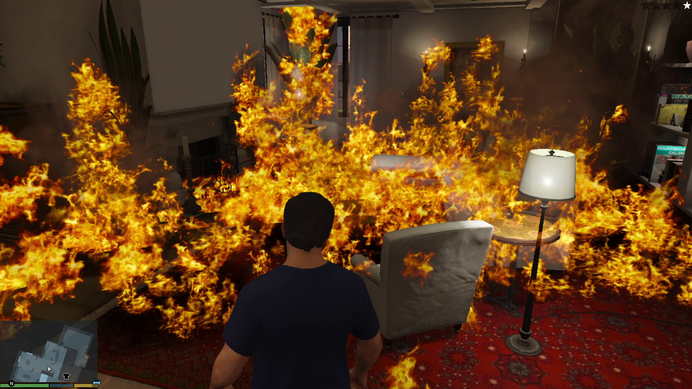

# MoreFire - *RPH Plugin*

RAGE Plugin Hook Plugin that makes fires burn longer/spread further.

The plugin also adds a console command (F4): `RemoveAllFire` which... removes all fires.

Available on [gta5-mods.com](https://www.gta5-mods.com/scripts/more-fire) and [lcpdfr.com](https://www.lcpdfr.com/downloads/gta5mods/scripts/52343-more-fire/).

## Configuration
You can adjust some values in the `.ini` file :
- ⏱ How long the fire will burn
- ⭕ The radius of fire propagation (how *fast* it spreads)
- 🔥 The max number of fires that can be active at once
- 🧯 The time required to extinguish it with a fire extinguisher (for player and NPCs)

## `ℹ` Prerequisite
- [RAGE Plugin Hook](https://ragepluginhook.net/Downloads.aspx)
